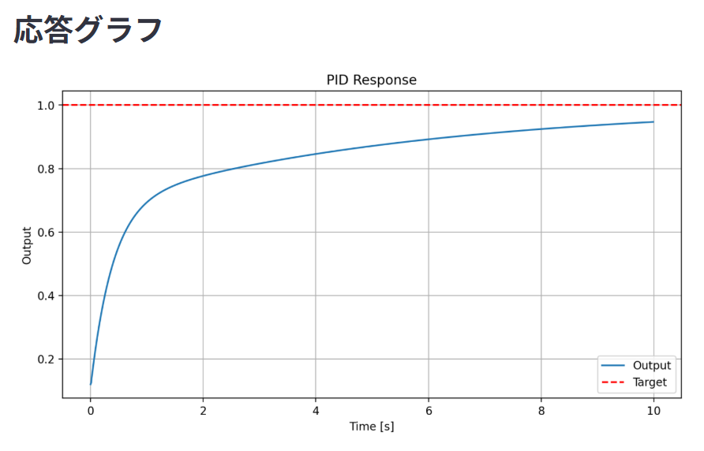
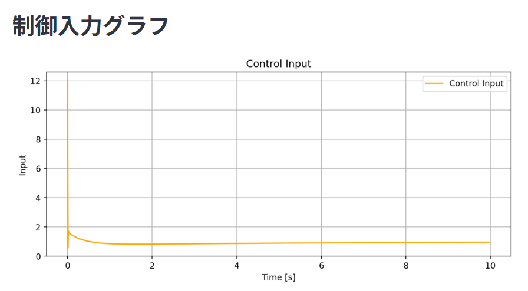

# PID制御シミュレーション可視化ツール

## 概要

PythonとStreamlitを用いて、PID制御の応答を可視化するシミュレーションツールを作成しました。

比例ゲイン \(Kp\)、積分ゲイン \(Ki\)、微分ゲイン \(Kd\) をスライダーで変更し、制御対象の応答がどのように変化するかを確認できます。

また、応答グラフだけでなく、制御入力グラフ、オーバーシュート、収束時間、定常偏差も表示できるようにしました。

## 使用技術

- Python
- NumPy
- Matplotlib
- Streamlit

## 主な機能

- PID制御のシミュレーション
- Pゲイン、Iゲイン、Dゲインの調整
- 目標値の変更
- 応答グラフの表示
- 制御入力グラフの表示
- オーバーシュートの計算
- 収束時間の計算
- 定常偏差の計算

## スクリーンショット

### 応答グラフ



### 制御入力グラフ



## 実行方法

必要なライブラリをインストールします。

```bash  
pip install numpy matplotlib streamlit  